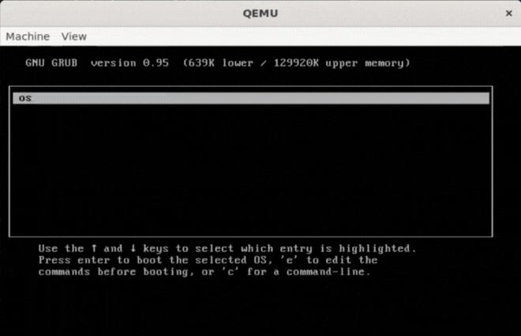

<h1 align="center" style="color: #FFFFFF"><em> TUGAS BESAR OS-IF2230 </em></h1>

<br>
<h1 align="center" style="color: #8ef7e9"> KELOMPOK </h1>
<p align="center">
  
</p>

<h2 align="center" style="color: #8ef7e9"> ANGGOTA </h2>
<p align="center">
  <br>
  <span style="font-size: 15px;">(13522032)</span><br><br>
  <br>
  <span style="font-size: 15px;">(13522040)</span><br><br>
  <br>
  <span style="font-size: 15px;">(13522074)</span><br><br>
  <br>
  <span style="font-size: 15px;">(13522120)</span><br><br>
</p>

<div align="center">
<br>
</div>

## 📒 Table of Contents
* [Deskripsi](#📄-deskripsi)
* [Struktur File](#📁-struktur-file)
* [Requirements](#❓-requirements)
* [Penggunaan](#🔨-penggunaan)
* [Acknowledgements](#acknowledgements)

## 📄 Deskripsi
> Sistem operasi (Operating System) adalah perangkat lunak yang mengelola perangkat keras komputer dan menyediakan layanan umum untuk program komputer. Sistem operasi bertindak sebagai perantara antara pengguna dan perangkat keras komputer, memungkinkan pengguna untuk menjalankan aplikasi dan program di atasnya dengan lebih efisien.

Tugas ini dibuat dalam rangka _introductory to kernel development_ dan meperlihatkan secara konkrit subsistem yang ada pada sistem operasi. Target platform sistem operasi adalah x86 32-bit Protected Mode yang nanti akan dijalankan dengan QEMU. Tugas ini dibuat dalam beberapa tahap (chapter) :

*Chapter 0*, berisi topik-topik sebagai berikut:
- Toolchain
- Kernel
- Global Descriptor Table

*Chapter 1*, berisi topik-topik sebagai berikut:
- Driver (Keyboard & Disk)
- File System

*Chapter 2*, berisi topik-topik sebagai berikut:
- User Mode
- Shell

*Chapter 3*, berisi topik-topik sebagai berikut:
- Scheduler
- Multitasking

## 📁 Struktur File
```bash
📦os-2024-operatingstress/
├── 📁bin/
│   └── gitignore
├── 📁img/
│   └── opses.gif
├── 📁other/
│   └── grub1
├── 📁src/
│   ├── 📁external/
│   │   └── external-inserter.c
│   ├── 📁header/
│   │   ├── 📁cpu/
│   │   │   ├── gdt.h
│   │   │   └── portio.h
│   │   ├── 📁driver/
│   │   │   ├── disk.h
│   │   │   └── keyboard.h
│   │   ├── 📁filesystem/
│   │   │   └── fat32.h
│   │   ├── 📁interrupt/
│   │   │   ├── idt.h
│   │   │   └── interrupt.h
│   │   ├── 📁memory/
│   │   │   └── paging.h
│   │   ├── 📁stdlib/
│   │   │   └── string.h
│   │   ├── 📁text/
│   │   │   └── framebuffer
│   │   └── kernel-entrypoint.h
│   ├── 📁stdlib/
│   │   └── string.c
│   ├── crt0.s
│   ├── disk.c
│   ├── fat32.c
│   ├── framebuffer.c
│   ├── gdt.c
│   ├── idt.c
│   ├── interrupt.c
│   ├── intsetup.s
│   ├── kernel-entrypoint.s
│   ├── kernel.c
│   ├── keyboard.c
│   ├── linker.ld
│   ├── menu.lst
│   ├── paging.c
│   ├── portio.c
│   ├── user-linked.ld
│   └── user-shell.c
├── makefile
└── README.md
```

## ❓ Requirements
1. Netwide Assembler (NASM): Compiler assembly x86 untuk kode yang membutuhkan instruksi asm
2. GNU C Compiler: Compiler C untuk sistem operasi
3. GNU Linker: Linker object code hasil kompilasi
4. QEMU - System i386: Emulator-VM untuk menjalankan OS
5. GNU Make: Build tools
6. genisoimage: Tool untuk pembuatan image
7. GDB: Debugger
8. WSL (Windows Subsytem for Linux) bila menggunakan windows

## 🔨 Penggunaan
1. Clone repository ini dengan: 
    ```
    https://github.com/labsister21/os-2024-operatingstress.git
    ```
2. Install requierements yang dibutuhkan untuk menjalankan OS
3. Buka terminal pada root repository
4. Jalankan program dengan:
    ```
    make
    ```
5. Program akan tampil melalui QEMU
